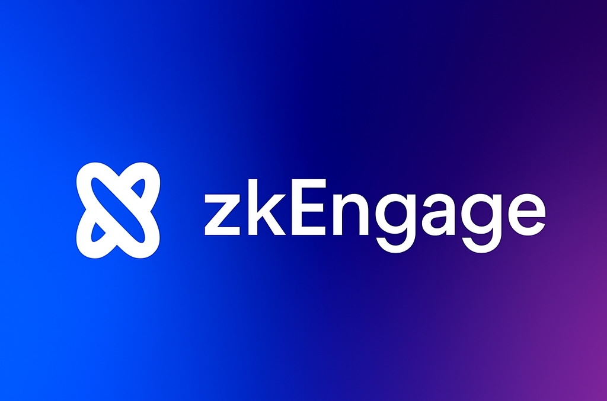

zkEngage

  

  
  
  

### 🔒 Privacy-Preserving Proof of Engagement, Powered by zkVerify  

---

🚀 Overview

zkEngage is a prototype application built to showcase zkVerify’s capabilities in privacy-preserving engagement, reputation, and rewards. It explores how zero-knowledge proofs of engagement can be applied in practice, allowing users to prove participation without revealing sensitive wallet or transaction data.

With zkEngage, users can:

🎯 Complete quests and challenges to demonstrate engagement
🏅 Earn badges as on-chain proof of activity
🔒 Have their participation verified privately through zkVerify without exposing wallet history
🎁 Unlock future incentives such as NFTs, rewards, or compliance-friendly proofs

This project serves as a real-world demonstration of zkVerify integration, focusing on gamified reputation, private rewards, and portable proofs that drive Web3 adoption.

---

## 🔑 Problem  
Web3 communities face serious challenges when it comes to verifying real participation and rewarding engagement without compromising privacy:

❌ No private proof of activity — Most systems rely on wallet tracking, exposing user history.

❌ Weak reputation models — Engagement is hard to measure beyond token balances or transactions.

❌ Bot-driven communities — Email signups, likes, or yaps can be faked with multiple accounts.

❌ Risky incentive models — Airdrops and rewards leak user data by tying activity to full wallets.

❌ Compliance friction — Projects struggle to prove eligibility without over-collecting data.

---

## 💡 Solution — zkEngage  
zkEngagement introduces private, verifiable proofs of engagement using **zkVerify**:  

✅ Private On-Chain Reputation – “This wallet engaged 10+ times” without revealing history.

✅ Compliance-Friendly Proofs – Show thresholds without exposing balances or identity.

✅ Private Rewards – Unlock NFTs, badges, or perks with zero-knowledge proofs.

✅ Cross-Chain Ready – Portable verification across ecosystems.

---

## 🛠️ Repository Structure  
- `client/` → Frontend (React + Vite + Tailwind)  
- `server/` → Backend logic (TypeScript + Prisma Schema)  
- `shared/` → Shared utilities & types  
- `Web structure.md` → Project architecture & flow  

This repo is currently at **prototype stage** — zkVerify integration is the next milestone.  

---

## 🎨 Preview  
will be updated

---

## ⚙️ Installation & Setup  
``bash
# Clone repo  
git clone https://github.com/zkEngage/zkEngage.git  
cd zkEngage  

# Install dependencies  
npm install

# Run Frontend server
npm run dev 

# Run development server  
npm run dev

---

## 📌 Roadmap  

| Phase | Goal |
|-------|------|
| 1 | Prototype zk proof flows (local verification) |
| 2 | Integrate **zkVerify Relayer** |
| 3 | Build demo UI for engagement proofs |
| 4 | Pilot use cases (private reputation, rewards, compliance checks) |

---

🔗 Resources

zkVerify Docs: https://docs.zkverify.io

Horizen Labs: https://horizenlabs.io

---

👤 Author

Emmanuel Nwajari - zkEngage

📧 De_real_iManuel@hotmail.com | corruptioncoin1@outlook.com

🐦 @De_real_iManuel

🔗 Portfolio: Under review...

---

🤝 Contributing

Contributions, issues, and feature requests are welcome!
Feel free to fork this repo and submit a pull request.

---

## 📄 License  
This project is under a **Restricted License**.  
Usage is permitted only for approved contributors and zkVerify/Horizen Labs.  
See the [LICENSE](LICENSE) file for details.

---

⚡ Note

zkEngage is in early development. Current code demonstrates architecture and flow; zkVerify integration is upcoming. This repo will be continuously updated as milestones are reached.
